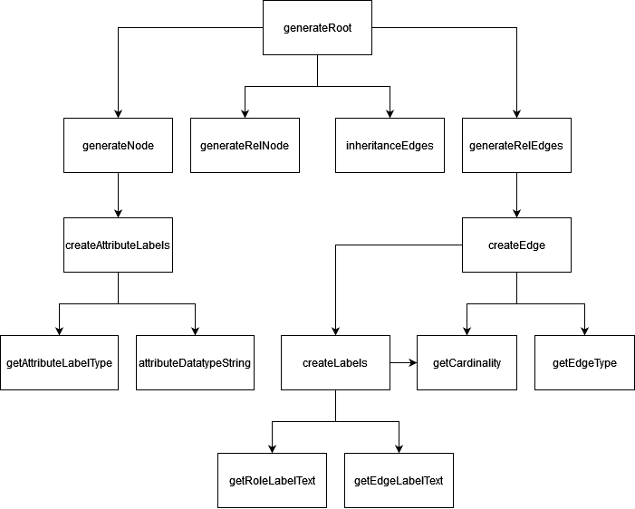

# Developer Guide

## Project Structure
BigER (and BigERlangium) is a textual-visual-hybrid entity-relationship diagram modeling tool, based on a server-client architecture, accessed as a VSCode extension.

The code can be found in the `packages/` directory with the following modules:
- `language-server/` - main *server-side* module responsible for *grammar*, *language services* (e.g. validation) and diagram generation.
- `webview/` - main *client-side* module responsible for visual content, including diagram styling, VSCode buttons and edge-routing.
- `extension/` - editor-spcific code, mainly for managing visual content, such as syntax highlighting and view panels.
- `common/` - space for code used by multiple other modules, discouraged for complex functionalities to keep separation. Contains some potentially useful utilities like common type enumerations.

relevant files:
- [entity-relationship.langium](./packages/language-server/src/entity-relationship.langium) - controls functional language features, e.g. keywords
- [language-configuration.json](./packages/extension/language-configuration.json) - controls declarative language features, e.g. indentation rules, bracket auto-closing, etc. (see [VS Code Docs: Language Configuration Guide](https://code.visualstudio.com/api/language-extensions/language-configuration-guide))
- [diagram-generator.ts](./packages/language-server/diagram-generator.ts) - responsible for creating a diagram from the AST.
- [package.json](./package.json) - extension manifest with dependencies, scripts and VS Code contribution points (see [Extension Manifest](https://code.visualstudio.com/api/references/extension-manifest) and [Contribution Points](https://code.visualstudio.com/api/references/contribution-points))
- [entity-relationship.tmLanguage.json](./packages/extension/syntaxes/entity-relationship.tmLanguage.json) - contains the [TextMate grammar](https://macromates.com/manual/en/language_grammars) for syntax highlighting of the language keywords (see [VS Code Docs: Syntax Highlighting Guide](https://code.visualstudio.com/api/language-extensions/syntax-highlight-guide))
- [launch.json](./.vscode/launch.json) - launch configuration to run the extension with the `examples/` folder as the workspace (see [VS Code Docs: Launch Configuration](https://code.visualstudio.com/docs/editor/debugging#_launch-configurations))

For further details on *Sprotty* and *VSCode* extension logic see Glaser PL.: Developing Sprotty-based Modeling Tools for VS Code.

For further details on *diagram generation* and *language services* see Jordan T. & Zib S.: A Langium-based approach to BigER.

For further details on *edge-routing* see Hnatiuk V.: Adaptagrams/libavoid for Sprotty.

[Resources](#resources)

## Diagram Generation

Diagram Generation is done in [diagram-generator.ts](./language-server/src/diagram/diagram-generator.ts) and starts with generateRoot(...). This function is called when the [Diagramserver](https://github.com/eclipse-sprotty/sprotty/blob/55f6b055ff880575a1befcaf45f25acb24eb7d2d/packages/sprotty-protocol/src/diagram-server.ts) receives a RequestModelAction (see [actions.ts](https://github.com/eclipse-sprotty/sprotty/blob/55f6b055ff880575a1befcaf45f25acb24eb7d2d/packages/sprotty-protocol/src/actions.ts)) from the client.

## Sprotty Actions
* For client-server communication, use sprotty actions (see node_modules/sprotty-protocol/src/actions.ts). Custom actions can be added in 'webview/'. 
* An action can be dispatched by buttons (via the action field) or the actionDispatcher (via actionDispatcher.dispatch(...)) injectable in sprotty classes (like IActionHandler). 
* An actionHandler can be attached to actions through the function 'configureActionHandler(...)' in 'webview/di.config.ts'.
* On the extension side, a handler is attached to the endpoint in 'createEndpoint' in 'extension/src/webview-panel-manager.ts'.
* Custom actions can either be added through a custom handler (see above), or by extending the 'VscodeLspEditDiagramServer' class and overriding the 'initialize' function in the extension module.
* By default, actions are handled on the client side. To enable server-sided hadling, extend 'VscodeLspEditDiagramServer' and override 'initialize' and 'handleLocally' functions to include your custom actions. Note that 'handleLocally' must return **TRUE** in order for actions to be sent to the server. 
* To make an action handler await a response from the server, use 'actionDispatcher.request(...).then(...)'.

## Known Issues
URI serialization on windows is currently mismatched with langium, causing automatic text-diagram-synchronization to break. This is currently resolved through overriding the function 'createDiagramIdentifier' in 'packages/extension/src/webview-panel-manager.ts'

## Pull Request

First, make sure your repository is up-to-date by pulling the latest changes from the `master` branch:

```bash
git pull origin master
```

Then create a new branch and commit your changes:

```bash
# create a new branch 
git checkout -b your-branch-name

# commit changes
git commit -m "Describe changes..."
```

Push the newly created branch with your changes to GitHub:

```bash
git push origin your-branch-name
```

Afterwards, the new branch should be visible on GitHub and you can [create a new Pull Request](https://docs.github.com/en/pull-requests/collaborating-with-pull-requests/proposing-changes-to-your-work-with-pull-requests/creating-a-pull-request). 

## Miscellaneous
project originally set up with following dependencies:
        
        - "@vscode/codicons": "^0.0.33"
        - "@vscode/webview-ui-toolkit": "^1.2.2"
        - "chalk": "~4.1.2"
        - "chevrotain": "~10.4.2"
        - "commander": "~10.0.0"
        - "langium": "~1.1.0"
        - "langium-sprotty": "~1.1.0"
        - "reflect-metadata": "^0.1.13"
        - "sprotty": "^0.13.0"
        - "sprotty-elk": "^0.13.0"
        - "sprotty-routing-libavoid": "^1.1.1"
        - "sprotty-vscode": "^0.5.0"
        - "sprotty-vscode-protocol": "^0.5.0"
        - "sprotty-vscode-webview": "^0.5.0"
        - "vscode-languageclient": "^8.0.2"
        - "vscode-languageserver": "~8.0.2"
        - "vscode-uri": "~3.0.7"

VSCode API features are NOT available on the client side (webview), only in the extension.

Inversify (dependency injection) is only available in sprotty classes or their extensions.

## Resources

**bigER:**
- [GitHub Repo](https://github.com/borkdominik/bigER)
- [Wiki](https://github.com/borkdominik/bigER/wiki)
- [Blog Post](https://modeling-languages.com/hybrid-textual-graphical-er-modeling-vscode/)
- [Thesis: Developing Sprotty-based Modeling Tools for VS Code](https://model-engineering.info/publications/theses/thesis-glaser.pdf), particularly Chapter 3: *Developing Sprotty-based Modeling Tools* and Chapter 4: *The bigER Modeling Tool*
- [Thesis: Adaptagrams/libavoid for Sprotty](https://model-engineering.info/publications/theses/thesis-hnatiuk.pdf)
- [Thesis: A Langium-based approach to BigER](https://model-engineering.info/publications/theses/thesis-jordan-zib.pdf)
- [Paper 1](https://publik.tuwien.ac.at/files/publik_297480.pdf)
- [Paper 2](https://ceur-ws.org/Vol-3211/CR_120.pdf?trk=public_post_comment-text)

**VS Code / LSP:**
- [Extension Samples](https://github.com/microsoft/vscode-extension-samples)
- [Extension Guides](https://code.visualstudio.com/api/extension-guides/overview)
- [Language Extension Guides](https://code.visualstudio.com/api/language-extensions/overview)
- [VS Code Language Server Extension Guide](https://code.visualstudio.com/api/language-extensions/language-server-extension-guide) 
- [Language Server Protocol (LSP)](https://microsoft.github.io/language-server-protocol/)

**Langium / Sprotty:**
- [sprotty](https://github.com/eclipse-sprotty/sprotty)
- [langium-sprotty](https://github.com/langium/langium/tree/main/packages/langium-sprotty)
- [sprotty-vscode](https://github.com/eclipse-sprotty/sprotty-vscode)
- [TypeFox Blog](https://www.typefox.io/blog/) (developers/maintainers of Sprotty and Langium)

**Examples:**
- [States Example](https://github.com/eclipse-sprotty/sprotty-vscode/tree/master/examples/states-langium)
- [stpa](https://github.com/kieler/stpa)
- [DSL Dataset Descriptor](https://github.com/ReviewInstrumental/DSL-dataset-description)
- [HotDrink DSL](https://github.com/MathiasSJacobsen/HotDrink-DSL)
